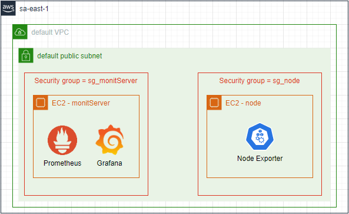
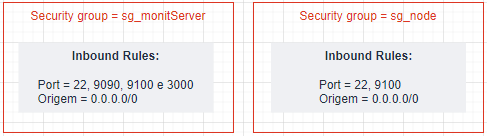
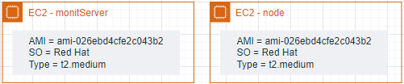
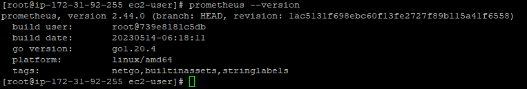
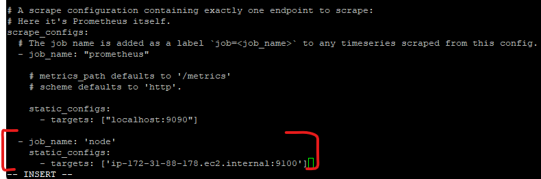
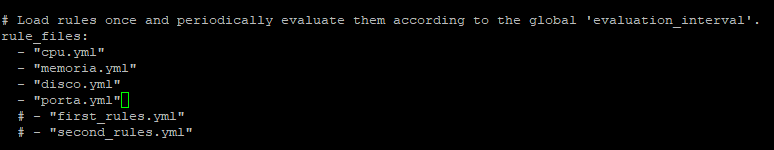
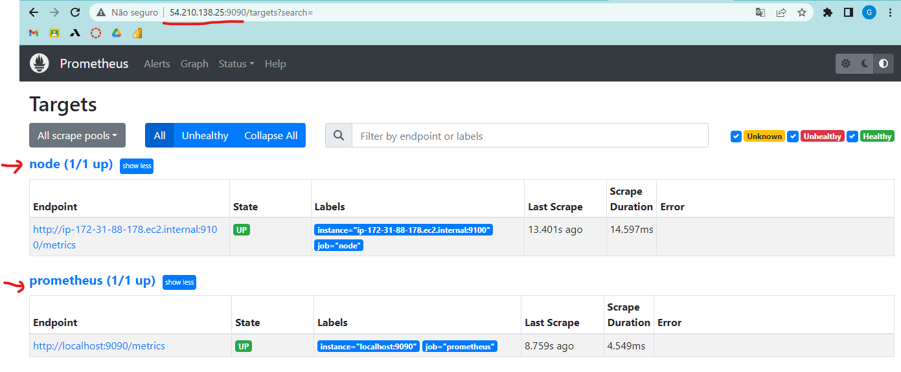
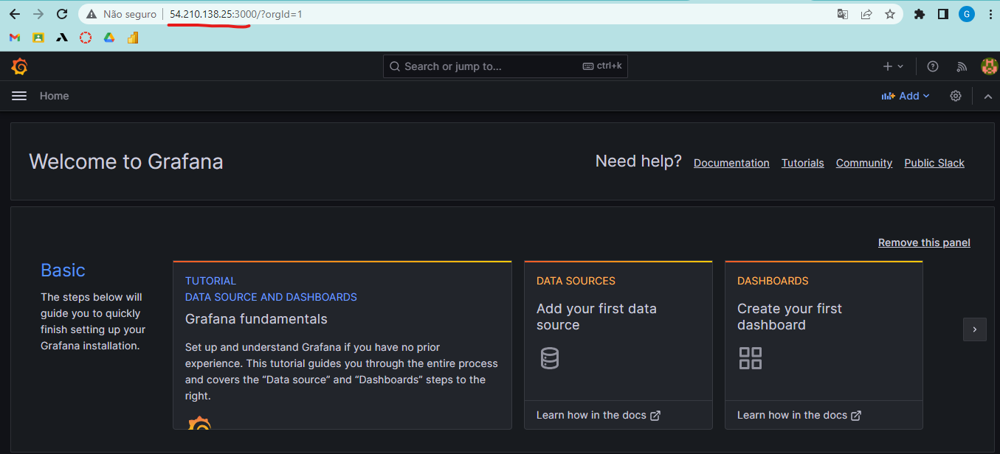

#  EC2 - Prometheus e Grafana 

**Objetivo**: Criar um ambiente de monitoração na AWS com base em Prometheus e Grafana em instâncias EC2.

Design da arquitetura:


Criar 2 instâncias EC2 com Terraform onde:

- 1 instância terá o Prometheus instalado para capturar as métricas de monitoração e o Grafana para criação do Dashboard;
- 1 instância terá um Node Exporter instalado para exportar as métricas para o Prometheus.

## Procedimento

Executar os arquivos Terraform no repo local com os seguintes comandos:

```go
terraform init

terraform plan

terraform apply
```

A configuração dos Security Groups e Instâncias criadas é a seguinte:





Ao criar as instâncias, acessar a máquina **monitServer** com SSH e executar os seguintes comandos:

```sh
# instalação de pacotes
dnf install wget git net-tools
```
```sh
# criação do usuário prometheus
useradd -m -s /bin/false prometheus
```

Criar o repo `/etc/yum.repos.d/prometheus-rpm_release.repo` com o comando:

```sh
vi /etc/yum.repos.d/prometheus-rpm_release.repo
```

precionar a tecla `i` para hailitar o modo de inserção e colar o seguinte conteúdo no arquivo:

```
[prometheus-rpm_release]
name=prometheus-rpm_release
baseurl=https://packagecloud.io/prometheus-rpm/release/el/8/$basearch
repo_gpgcheck=0
gpgcheck=0
enabled=1
gpgkey=https://packagecloud.io/prometheus-rpm/release/gpgkey
sslverify=1
sslcacert=/etc/pki/tls/certs/ca-bundle.crt
metadata_expire=300

[prometheus-rpm_release-source]
name=prometheus-rpm_release-source
baseurl=https://packagecloud.io/prometheus-rpm/release/el/8/SRPMS
repo_gpgcheck=0
gpgcheck=0
enabled=1
gpgkey=https://packagecloud.io/prometheus-rpm/release/gpgkey
sslverify=1
sslcacert=/etc/pki/tls/certs/ca-bundle.crt
metadata_expire=300
```

Precionar a tecla `esc` + `shift` + `:` + `wq` para salvar as alterações e fechar o arquivo.

Instalar o Prometheus rodando o comando:

```sh
dnf install prometheus
```

Para validar a instalção, basta executar:

```sh
prometheus --version
```




Acessar a instância **node** com SSH para fazer a instalação do Node Exporter.

Executar os seguintes comandos:

```sh
# atualização de pacotes
dnf install wget git net-tools
```
criar o repo `/etc/yum.repos.d/prometheus-rpm_release.repo` como no passo anterior.

```sh
# instalação do node exporter
dnf install node_exporter
```

```sh
# start do serviço
systemctl start node_exporter
```

Acessar a instância **monitServer** novamente e editar o arquivo `/etc/prometheus/prometheus.yml` adicionando no final do arquivo o endpoint do Node Exporter da seguinte forma:

```yml
- job_name: 'node'
  static_configs:
     - targets: ['<Nome do DNS de IP privado (somente IPv4) da sua instância>:9100']
```

Exemplo:


> **Warning**
>
> Por se tratar de um arquivo .yml, cuidado com a identação.

Restartar o serviço do Prometheus executando:

```sh
systemctl restart prometheus
```

Editar o arquivo `/etc/prometheus/prometheus.yml` para adicionar o endpoint do Node Exporter no final do arquivo com o seguinte conteúdo:

```yml
- job_name: 'node'
  static_configs:
     - targets: ['ip-172-31-88-178.ec2.internal:9100']
```
> **Obs**.: O ip precisa ser o IP da instância node.

Dar um stop/ start no serviço do Prometheus:

```sh
systemctl restart prometheus
```

**Criação das Métricas**

Para poder monitorar a performance, disponibilidade e segurança, serão construídas as seguintes métricas:

- Performance → monitoração de CPU 
- Disponibilidade → monitoração de memória e disco
- Segurança → portas lógicas

Dentro da pasta `/etc/prometheus` criar o arquivo `cpu.yml` com o seguinte conteúdo:

```yml
groups:
  - name: cpu_alerts
    rules:
      - alert: HighCPUUsage
        expr: (100 - (avg by (instance) (irate(node_cpu_seconds_total{mode="idle"}[5m])) * 100)) * 100 > 5
        for: 30s
        labels:
          severity: critical 
        annotations:
          summary: High CPU usage on instance {{$labels.instance}}
          description: CPU usage is above 5% on instance {{$labels.instance}}.
```

Dentro da pasta `/etc/prometheus` criar o arquivo `memoria.yml` com o seguinte conteúdo:

```yml
groups:
  - name: memory_alerts
    rules:
      - alert: HighMemoryUsage
        expr: (node_memory_Active_bytes / node_memory_MemTotal_bytes) * 100 > 20
        for: 5m
        labels:
          severity: warning
        annotations:
          summary: High memory usage on instance {{$labels.instance}}
          description: Memory usage is above 20% on instance {{$labels.instance}}.
```

Dentro da pasta `/etc/prometheus` criar o arquivo `disco.yml` com o seguinte conteúdo:

```yml
groups:
  - name: disk_alerts
    rules:
      - alert: HighDiskUsage
        expr: 100 - (node_filesystem_avail_bytes * 100 / node_filesystem_size_bytes) > 10
        for: 30s
        labels:
          severity: warning
        annotations:
          summary: High disk usage on instance {{$labels.instance}}
          description: Disk usage is above 10% on instance {{$labels.instance}}.
```

Dentro da pasta `/etc/prometheus` criar o arquivo `porta.yml` com o seguinte conteúdo:

```yml
groups:
  - name: port80_alerts
    rules:
      - alert: Port80DownAlert
        expr: up == 0
        for: 1m
        labels:
          severity: critical
          port: "80"
        annotations:
          summary: "Porta 80 fora do ar"
          description: "A porta 80 do host {{ $labels.instance }} está fora do ar." 
```

Editar o arquivo `/etc/prometheus/prometheus.yml` adicionando os 4 arquivos de métricas criados anteriormente dentro de `rules_files`:



Testar o Prometheus acessando via browser o `IP_SUA_INSTANCIA:9100`



**Instalação do Grafana**

Criar o repositório `/etc/yum.repos.d/grafana.repo` com o seguinte conteúdo:

```sh
[grafana]
name=grafana
baseurl=https://packages.grafana.com/oss/rpm
repo_gpgcheck=1
enabled=1
gpgcheck=1
gpgkey=https://packages.grafana.com/gpg.key
sslverify=1
sslcacert=/etc/pki/tls/certs/ca-bundle.crt
```

Fazer update da policy:

```sh
update-crypto-policies --set DEFAULT:SHA1
```

Instalar o Grafana:

```sh
dnf install grafana
```

Para validar a execução execute:

```sh
grafana-server -v
```

Realizar o start do serviço:

```sh
systemctl daemon-reload
systemctl enable --now grafana-server
```

Acessar o grafana no browser com `IP_monitServer:3000`.

> **Note**
>
> - user = admin
> - senha = admin

